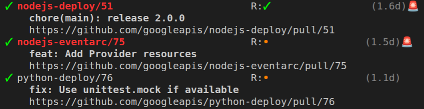

# `gh slocheck` - PR followup helper

This tool is a gh-extension that helps me ensure PRs in a large number of
repositories get timely followup. Given a [github search
string](https://docs.github.com/en/search-github/searching-on-github/searching-issues-and-pull-requests)
and a warning duration, it calls attention to PRs that need attention.

#### Usage

- `-w` - Warning time, as a duration. Unfortunately, Go's Duration does not respect a `d` suffix for days, so it must be specified in hours.
- `-s` - a [github search string](https://docs.github.com/en/search-github/searching-on-github/searching-issues-and-pull-requests)

For search specifiers that are common to all searches, you may set the
environment variable `GH_SLOCHECK_SEARCH_EXTRAS` to a partial github search
string. For example, the following sets the sort order, and excludes draft PRs:

`GH_SLOCHECK_SEARCH_EXTRAS="sort:updated-asc draft:false"`

#### Output

For each PR, the tool presents (in order, from the left):
1. Status Indicator - The rollup status for the lastest commit in the PR. (i.e.
    do the required checks pass)
    - Green checkmark for passing, red X if failing, and a yellow dot if actions are still running.
1. Review Status - green check for approved, red x for changes requested, orange dot for pending.
1. Merge Status - green check for merged, orange dot for mergeable, red x for conflicts.
1. Time Since Last Updated - Listed in days
1. A 'slug' of repository name and PR number, for reference.
1. The full Title of the PR
1. The URL of the PR



#### Installation

This is an extension for the [`gh` cli tool](http://cli.github.com). If you're already using this tool, you can install this extension with: 

```
gh extension install http://github.com/muncus/gh-slocheck
```